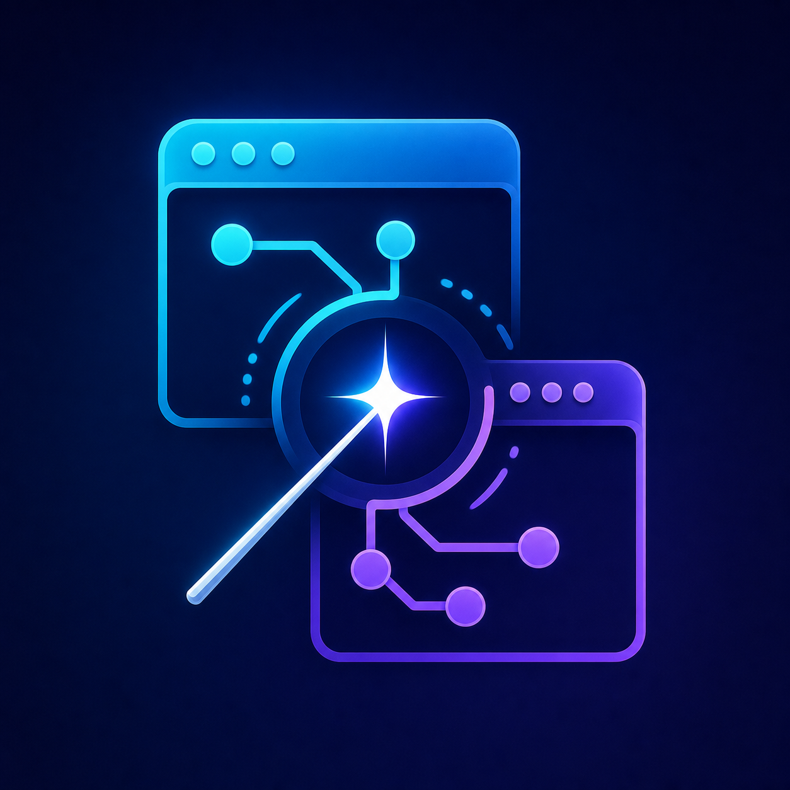

# AgentController

<p align="center">
  
</p>

[](https://github.com/Kasempiternal/agentcontroller/actions/workflows/ci.yml)


[](LICENSE)

**Native app QA automation for AI agents, exposed over MCP (Model Context Protocol).**

AgentController lets Claude Code—or any MCP client—drive and *test* native applications on **macOS, Windows, and iOS** (simulators and physical iPhones). It exposes a portable automation vocabulary for clicking, typing, screenshots, menus, accessibility inspection, assertions, and replayable flows, backed by native platform APIs rather than a browser-only abstraction.

Its defining feature is background-first automation. On macOS, every tool is background-safe by default. On Windows, UI Automation patterns run without moving the pointer, while the five raw-input gestures require explicit `foreground:true` authorization and restore the prior focus and cursor afterward.

## Platform support

| Platform | Native stack | Transport | Distribution |
|---|---|---|---|
| macOS 14+ | Swift, AXUIElement, CGEvent, ScreenCaptureKit | Local HTTP through a resilient stdio bridge | Signed `.app` and `.dmg` |
| Windows 10/11 | C#/.NET, UI Automation, Win32 `SendInput` | MCP stdio directly | Self-contained `.exe` |
| iOS (simulator + iPhone) | TypeScript/Node, `idb`, native AX scanner, WebDriverAgent | MCP stdio directly (runs on the Mac) | `node dist/cli.js` |

The two desktop backends register the same 49-tool contract. Windows currently has 46 native implementations and returns explicit unsupported errors for `reset_app_state`, `start_recording`, and `stop_recording`; see the [Windows guide](Windows/README.md) for platform-specific behavior. The iOS backend registers its own 36-tool surface shaped for phones (gestures, hardware buttons, device lifecycle) rather than force-fitting the desktop vocabulary — see the [iOS guide](iOS/README.md).

---

## Table of contents

- [Highlights](#highlights)
- [Platform support](#platform-support)
- [How it works](#how-it-works)
- [Requirements](#requirements)
- [Installation](#installation)
- [Setup](#setup)
- [Migrating from v1](#migrating-from-v1)
- [Quick start](#quick-start)
- [Fully-background QA](#fully-background-qa)
- [Tool catalog](#tool-catalog)
- [Security](#security)
- [Development](#development)
- [Troubleshooting](#troubleshooting)
- [Contributing](CONTRIBUTING.md)
- [Credits and prior art](#credits-and-prior-art)
- [License](#license)

## Highlights

- **49 desktop MCP tools** covering app control, AX inspection, input, assertions, screenshots, video recording, menus, clipboard, windows, and replayable flows — see the full [Tool Reference](docs/TOOLS.md) — plus a **36-tool iOS backend** for simulators and physical iPhones ([iOS guide](iOS/README.md)).
- **Background by default** — apps launch without activating, input is delivered per-process (`CGEvent.postToPid`) or via pure AX actions, menus are resolved by *reading* the AX tree, and screenshots read the window's own backing store (works even fully covered or hidden).
- **Real assertions** — `assert_visible` / `assert_not_visible` / `assert_value` poll until satisfied and return MCP `isError` on failure, so an agent's control loop gets an unambiguous PASS/FAIL instead of parsing prose.
- **Stable element handles** — `snapshot` returns a compact `[{id, role, label, enabled, frame}]` list; interaction tools accept `elementId` for O(1) reuse without re-searching.
- **Token-lean by design** — JPEG screenshots with a size cap by default, compact snapshots instead of full trees, text extraction instead of OCR.
- **Replayable flows** — record a sequence once (`save_flow`), re-run it as a regression test (`run_saved_flow`).
- **Hardened transport** — loopback-only listener, per-launch 256-bit bearer token, DNS-rebinding defenses. See [Security](#security).

## How it works

```
Claude Code ──stdio──▶ agentcontroller-mcp-bridge.sh ──HTTP POST──▶ AgentController.app
 (MCP client)           (~/.agentcontroller/)           localhost     (menu-bar app)
                                                                 │
                                                  Accessibility API + CGEvent
                                                  ScreenCaptureKit
                                                                 │
                                                                 ▼
                                                          App under test
```

AgentController runs as a menu-bar app (`LSUIElement`, no Dock icon) hosting a bespoke HTTP + JSON-RPC 2.0 server on a random loopback port. A resilient stdio bridge script translates MCP's stdio transport to HTTP, re-resolving the port and auth token automatically — so rebuilding or restarting AgentController never kills an active Claude Code session.

| Module | Responsibility |
|---|---|
| `Sources/App` | Menu-bar app, permissions UX, server lifecycle |
| `Sources/MCPServer` | HTTP listener, JSON-RPC 2.0, auth |
| `Sources/MCPTools` | The 49 tool definitions and handlers |
| `Sources/AccessibilityEngine` | AX tree walking/search, input synthesis, window/app management |
| `Sources/ScreenCapture` | ScreenCaptureKit screenshots, video recording, content caching |

## Requirements

**macOS:** macOS 14 Sonoma or later on Apple Silicon, plus Xcode 16 / Swift 5.10+ and a stable code-signing identity when building from source. Recording requires the macOS 15 SDK to compile and is runtime-gated to macOS 15+.

**Windows:** Windows 10 or 11 and the .NET 9 SDK for source builds. The default publish command produces a self-contained x64 executable, so target machines do not need a separate .NET installation.

## Installation

Clone once for either platform:

```bash
git clone https://github.com/Kasempiternal/agentcontroller.git
cd agentcontroller
```

### macOS

```bash
# Full release: Developer ID sign + notarize + staple + DMG + install
./build.sh

# Signed but not notarized (day-to-day iteration; Gatekeeper warns once)
./build.sh --skip-notarize

# Ad-hoc dev mode (fastest, but TCC grants do NOT persist across rebuilds)
./build.sh --dev
```

`build.sh` kills any running instance, builds, signs, installs to `/Applications/AgentController.app`, deploys the bridge script to `~/.agentcontroller/`, and relaunches the app.

### Windows

```powershell
.\Windows\build.ps1
.\Windows\smoke.ps1 -Server .\Windows\publish\win-x64\agentcontroller-windows.exe
```

Register `Windows\publish\win-x64\agentcontroller-windows.exe` directly as an MCP stdio server. Full configuration and the elevated interactive integration test are documented in [Windows/README.md](Windows/README.md).

The default signing identity is set at the top of `build.sh`; override per-invocation with:

```bash
SIGN_ID='Apple Development: Your Name (TEAMID1234)' ./build.sh --skip-notarize
```

For notarized release builds, store notarization credentials once (create an app-specific password at [appleid.apple.com](https://appleid.apple.com) first):

```bash
xcrun notarytool store-credentials agentcontroller-notary \
  --apple-id <your-apple-id> --team-id <your-team-id> --password <app-specific-password>
```

### Why signing matters

macOS TCC keys Accessibility and Screen Recording grants to the signing identity's **Team ID**. Signing with any stable certificate (Developer ID *or* Apple Development, same team) means you grant the permissions **once** and they survive every rebuild. Ad-hoc signing (`--dev`) keys grants to the binary hash, which changes on every compile.

## Setup

**1. Grant permissions (one time).** On first launch AgentController prompts for the two permissions it needs — grant them to **AgentController.app** (not your terminal):

- *System Settings → Privacy & Security → Accessibility → AgentController*
- *System Settings → Privacy & Security → Screen Recording → AgentController*

**2. Register the MCP server with Claude Code.** Either user-scoped (available in all projects):

```bash
claude mcp add --scope user agentcontroller -- ~/.agentcontroller/agentcontroller-mcp-bridge.sh
```

…or per-project, by adding to the project's `.mcp.json`:

```json
{
  "mcpServers": {
    "agentcontroller": {
      "command": "/Users/<you>/.agentcontroller/agentcontroller-mcp-bridge.sh"
    }
  }
}
```

**3. Verify.** Restart Claude Code; the tools appear as `mcp__agentcontroller__*`. Ask Claude to run `check_permissions` — it should report `"allGranted": true`. (Auto-start on login: *System Settings → General → Login Items → add AgentController*.)

## Migrating from v1

Version 2.0 changes the product name, executable names, bundle identifier, MCP server names, and runtime directories. Existing installations are intentionally not deleted automatically.

- On macOS, remove the old MCP registration, install `AgentController.app`, grant Accessibility and Screen Recording again for the new `izotz.agentcontroller` bundle identifier, then register `agentcontroller` using `~/.agentcontroller/agentcontroller-mcp-bridge.sh`.
- On Windows, update the MCP command to `agentcontroller-windows.exe`; saved flow files now live under `%LOCALAPPDATA%\AgentController\flows`.
- After confirming v2 works, the previous app and its legacy runtime directory can be removed manually. They are not read or overwritten by AgentController.

## Quick start

A typical QA exchange with Claude Code:

> *"Launch MyApp and verify the onboarding flow works, while I keep working."*

Under the hood the agent composes tools like this:

```jsonc
// 1. Start the app WITHOUT stealing focus
{ "tool": "launch_app", "args": { "bundleId": "com.example.MyApp" } }

// 2. (optional) Make it completely invisible for the whole run
{ "tool": "hide_app", "args": { "app": "com.example.MyApp" } }

// 3. See what's on screen — compact list with stable ids e1, e2, …
{ "tool": "snapshot", "args": { "app": "com.example.MyApp" } }

// 4. Interact by handle or selector (AX press / PID-targeted events)
{ "tool": "click",     "args": { "app": "com.example.MyApp", "elementId": "e7" } }
{ "tool": "type_text", "args": { "app": "com.example.MyApp", "role": "AXTextField", "text": "hello" } }

// 5. Assert — isError on failure makes PASS/FAIL unambiguous
{ "tool": "assert_visible", "args": { "app": "com.example.MyApp", "labelContains": "Welcome" } }

// 6. Visual evidence (works while hidden/covered)
{ "tool": "screenshot_window", "args": { "app": "com.example.MyApp" } }

// 7. Save the sequence as a regression test
{ "tool": "save_flow", "args": { "name": "onboarding-smoke", "steps": [ /* … */ ] } }
```

Selector matchers (`role`, `title`, `titleContains`, `identifier`, `value`, `description`, `descriptionContains`, `labelContains`, `index`) are accepted consistently across interaction, assertion, and inspection tools. Tip: use `labelContains` when you can see text on screen but don't know which AX attribute carries it — SwiftUI varies.

## Fully-background QA

Every tool is background-safe by default — a full test run happens while the user keeps working in another app, with their focus, cursor, and key window untouched:

- `launch_app` / `open_url` start apps **without activating** them (`foreground: true` to opt out)
- Input goes through `CGEvent.postToPid` (per-process queue) or pure AX actions — never the global HID stream, never a cursor warp
- `navigate_menu` resolves the menu tree by **reading** it; no menu ever opens on screen
- Screenshots and video read the window's own backing store: the tested window can be **fully covered** by the user's windows — capture stays correct
- `hide_app` makes the tested app completely invisible; interactions and even screenshots keep working (ScreenCaptureKit renders hidden windows fresh — verified)

Verified limitations, also stated in the tool descriptions so agents self-correct:

| Limitation | Workaround |
|---|---|
| The AX windows *list* is empty while an app is hidden | Use the default `scope: "window"`; focused-window tools and screenshots are unaffected |
| Minimized windows cannot be captured | `restore_window` first (makes the window visible again) |
| Clipboard / responder-chain commands (Cmd+C/V, Copy/Paste menu items) no-op without an active app | Verify content with `read_text` / `assert_value` instead, or `activate_app` briefly for paste flows |
| PID-targeted drags can desync (apps that poll the real pointer) | Set `foreground: true` for that gesture |

The single intentionally focus-changing tool is `activate_app`; everything else only escalates behind an explicit `foreground: true`. And since v1.4.0, **Focus Guard** (default on, toggle in the menu bar) turns that convention into a hard guarantee: while enabled, the dispatcher refuses `activate_app` and every `foreground:true` call with an error that points the agent back to the background-safe path — a misbehaving agent *cannot* steal your focus.

## Tool catalog

49 tools — full parameter documentation in **[docs/TOOLS.md](docs/TOOLS.md)** (generated from the live server's `tools/list`).

| Category | Tools |
|---|---|
| App control | `list_apps` · `launch_app` · `quit_app` · `activate_app` · `hide_app` · `unhide_app` · `get_frontmost_app` · `open_url` · `reset_app_state` |
| Snapshot & handles | `snapshot` / `describe_screen` |
| Inspection | `get_element_tree` · `find_elements` · `get_element_attributes` · `get_focused_element` · `wait_for_element` |
| Assertions | `assert_visible` · `assert_not_visible` · `assert_value` |
| Text | `read_text` · `read_all_text` |
| Input | `click` · `double_click` · `right_click` · `type_text` · `send_shortcut` · `scroll` · `scroll_until_visible` · `swipe` · `drag_drop` |
| Windows | `list_windows` · `get_window_bounds` · `set_window_bounds` · `minimize_window` · `restore_window` |
| Screenshots & video | `screenshot_window` · `screenshot_element` · `screenshot_screen` · `start_recording` · `stop_recording` |
| Menus | `navigate_menu` · `get_menu_structure` |
| Clipboard | `get_clipboard` · `set_clipboard` |
| Flows | `run_steps` · `save_flow` · `list_flows` · `run_saved_flow` |
| System | `check_permissions` |

## Security

The HTTP server is pinned to **IPv4 loopback** (never `0.0.0.0`), so it is unreachable from the network. Every request must carry `Authorization: Bearer <token>`; the server generates a fresh 256-bit token per launch, writes it to `~/.agentcontroller/mcp-token` (mode `0600`, alongside `mcp-port`), and the bridge replays it on each call with automatic re-resolution after restarts. Bearer comparison is constant-time. Requests carrying an `Origin` header or a non-loopback `Host` are rejected (`403`) to defeat DNS rebinding from a browser. Request bodies are size-capped (16 MiB) and reads are deadline-bounded (slowloris protection).

Destructive operations are opt-in: `reset_app_state` only deletes an app's sandbox container behind an explicit `wipeData: true` flag, and the clipboard tools warn that they touch system-wide state.

The Windows backend speaks MCP over stdio and opens **no listening socket**, so the loopback and token considerations above do not apply to it. The iOS backend is stdio too; its only listening socket is a loopback-pinned live-screen viewer, and WebDriverAgent's own unauthenticated port on the phone is called out honestly in the [iOS guide](iOS/README.md). Automating an app means reading its contents, and screenshots capture whatever is on screen — see [SECURITY.md](SECURITY.md) for the full threat model, what is explicitly out of scope, and how to report a vulnerability privately.

## Development

- Swift Package Manager, Swift 5.10+, **no third-party dependencies** on either platform (no `.package(url:)`, no `PackageReference`)
- Entry point: `Sources/App/AppDelegate.swift`; Info.plist is injected at link time via `-sectcreate` (see `Package.swift`)
- Rebuild loop: edit → `./build.sh --skip-notarize` → fresh binary in `/Applications` → the bridge reconnects automatically, tools keep working in any open Claude Code session
- Copy `.mcp.json.example` to `.mcp.json` for a project-scoped server; `.mcp.json` is gitignored because the client requires a machine-specific absolute path

```bash
swift build          # debug build
swift test           # unit tests (transport, JSON, selectors, input mapping)
swift build -c release -Xswiftc -warnings-as-errors   # what CI runs

./Scripts/check-tool-contract.sh   # tool contract: both backends + docs in sync
```

`check-tool-contract.sh` is the guard on this repo's central promise. The two
backends share no code, so only convention keeps their registries identical; the
script enforces that both expose the same tool set, that `docs/TOOLS.md`
documents exactly that set with descriptions matching the source strings, and
that every tool count quoted in prose is the real one. It needs only bash and
grep — no Swift, no .NET, no running server.

CI (`.github/workflows/ci.yml`) runs four jobs per push: the contract check plus
`shellcheck` on Ubuntu for the fastest signal, the iOS backend's TypeScript
typecheck and build (also Ubuntu — Node compiles anywhere even though the
runtime needs a Mac), the Swift build and tests on a macOS 15 runner with
warnings as errors, and the .NET build plus MCP protocol smoke on Windows.
`Windows/integration.ps1` drives real UI Automation and needs an interactive
desktop, so it stays a local pre-release step.

## Troubleshooting

| Symptom | Fix |
|---|---|
| Tools don't appear in Claude Code | Is AgentController running (menu-bar icon)? Re-add the MCP server, restart Claude Code |
| `AgentController is not running` errors from the bridge | Launch `/Applications/AgentController.app`; the bridge retries automatically on the next request |
| `check_permissions` shows a missing grant | Re-grant in System Settings → Privacy & Security; make sure the grant is for **AgentController.app**, not your terminal |
| Permissions reset after a rebuild | You built with `--dev` (ad-hoc). Use a real certificate so the Team ID stays stable |
| `Signing identity not found` from `build.sh` | Pass your own: `SIGN_ID='Apple Development: …' ./build.sh --skip-notarize` |
| Screenshot of a minimized window fails | By design — `restore_window` first |
| Clicks "succeed" but nothing happens | Check the result for an off-target `warning`; the coordinates may be outside the app's windows |
| An app ignores PID-targeted input (some Electron apps, games) | Retry the same tool with `foreground: true` |

## Credits and prior art

AgentController did not start from a blank page, and it is worth being precise about what came from where — precise in both directions.

Of roughly 14,700 lines of source here, about four fifths are original. The remaining fifth traces to one MIT-licensed project and is confined entirely to the iOS backend. No line of it comes from Maestro.

**Original to this project** are two of the three backends and the thing that binds them: the macOS backend (Swift, AXUIElement, CGEvent, ScreenCaptureKit) with its background-first automation model — driving an app without stealing your focus, cursor, or frontmost window; the Windows backend (C#/.NET, UI Automation, Win32 `SendInput`) with its explicit foreground-authorization rule for raw input; and the unified tool contract that lets one MCP client drive macOS, Windows, and iOS through a single shared vocabulary, enforced in CI by [`Scripts/check-tool-contract.sh`](Scripts/check-tool-contract.sh) because the backends share no code and nothing else would keep them honest. Those three platforms in one package, background-safe by default, are the point of the project.

**The interaction model comes from [Maestro](https://github.com/mobile-dev-inc/maestro) (mobile.dev, Apache-2.0).** Maestro's insight is that UI automation should be *tolerant*: a step waits for the interface to settle rather than failing on the first miss, and automation is expressed as reusable flows instead of one-shot commands. Both ideas are adopted here — every interaction runs an implicit find-and-retry loop, and `save_flow` / `run_saved_flow` make a recorded sequence a replayable regression test. **No Maestro source code is used.** Maestro targets mobile platforms on the JVM; the backends here are independent implementations against native platform APIs. The debt is one of design, and it is a real one.

**The iOS backend started as [blitzdotdev/iPhone-mcp](https://github.com/blitzdotdev/iPhone-mcp) (MIT).** That subtree in [`iOS/`](iOS/README.md) genuinely derives from upstream code, and the original MIT license and copyright notice are retained verbatim at [`iOS/LICENSE`](iOS/LICENSE). It has roughly doubled in size since, and what carries the load is substantially rewritten.

The largest change is the transport. Upstream drove the simulator by shelling out to the Python `fb-idb` CLI once per call. The hot paths here instead speak **gRPC directly to `idb_companion`** against a vendored protobuf, with HID event construction ported from `fb-idb`'s `hid.py`. Taps are acknowledged by the simulator in ~2ms rather than fired blind, and `describe_screen` answers in ~50-90ms. Python is not gone and the README does not claim it is — `fb-idb` survives as a fallback tier, reached through a warm `idb shell` framed as a request/response protocol over the `SUCCESS=` sentinel it prints after every command, with one-shot `idb` as a last resort. It is simply off the fast path.

Alongside that: loopback-only viewer binding (the screen stream is unauthenticated), argument-array process spawning instead of shell interpolation for tainted UDIDs and bundle IDs, deadlines on WebDriverAgent and `simctl` calls, parallel device discovery, downscaled JPEG previews, and a tool surface grown from ten to 36.

Full attribution, including third-party runtime dependencies, is in [NOTICE](NOTICE).

## License

Licensed under the [Apache License 2.0](LICENSE).

The `iOS/` subtree additionally carries its upstream [MIT license](iOS/LICENSE), which is retained as required; that code remains available under MIT. Attribution notices are in [NOTICE](NOTICE) — Apache-2.0 section 4(d) requires redistributors to carry them forward.
